# Kingsley Documentation of Project 6

## Web Solution With WordPress

*In this project i am tasked to prepare storage infrastructure on two Linux servers and implement a basic web solution using WordPress*

### Step 1

1. Launch an EC2 instance that will serve as “Web Server”. Create 3 volumes in the same AZ as your Project6-Webserver EC2, each of 10 GB

2. Attach all three volumes one by one to Project6-Webserver EC2 instance

3. Use `lsblk` command to inspect what block devices are attached to the server.

4. Use `df -h` command to see all mounts and free space on your server

5. Use gdisk utility to create a single partition on each of the 3 disks

`sudo gdisk /dev/nvme1n1`

`sudo gdisk /dev/nvme2n1`

`sudo gdisk /dev/nvme3n1`

5. Use `lsblk` utility to view the newly configured partition on each of the 3 disks.

6. Install lvm2 package using `sudo yum install lvm2` . Run `sudo lvmdiskscan` command to check for available partitions.

`sudo lvmdiskscan`

7. Use `pvcreate` utility to mark each of 3 disks as physical volumes (PVs) to be used by LVM

`sudo pvcreate /dev/nvme1n1p1 /dev/nvme2n1p1 /dev/nvme3n1p1`

8. Verify that your Physical volume has been created successfully by running  

`sudo pvs`

9. Use `vgcreate` utility to add all 3 PVs to a volume group (VG). Name the VG webdata-vg

`sudo vgcreate webdata-vg /dev/nvme1n1p1 /dev/nvme2n1p1 /dev/nvme3n1p1`

10. Verify that your VG has been created successfully by running sudo vgs

`sudo vgs`

11. Use `lvcreate` utility to create 2 logical volumes. apps-lv (Use half of the PV size), and logs-lv Use the remaining space of the PV size. NOTE: apps-lv will be used to store data for the Website while, logs-lv will be used to store data for logs

`sudo lvcreate -L 14G -n apps-lv webdata-vg`

`sudo lvcreate -L 14G -n logs-lv webdata-vg`

12. Verify that your Logical Volume has been created successfully by running 

`sudo lvs`

13. Verify the entire setup

`sudo vgdisplay -v #view complete setup - VG, PV, and LV`

`sudo lsblk`

14. Use mkfs.ext4 to format the logical volumes with ext4 filesystem

`sudo mkfs.ext4 /dev/webdata-vg/apps-lv`

`sudo mkfs.ext4 /dev/webdata-vg/logs-lv`

15. Create /var/www/html directory to store website files

`sudo mkdir -p /var/www/html`

16. Create /home/recovery/logs to store backup of log data

`sudo mkdir -p /home/recovery/logs`

17. Mount /var/www/html on apps-lv logical volume

`sudo mount /dev/webdata-vg/apps-lv /var/www/html/`

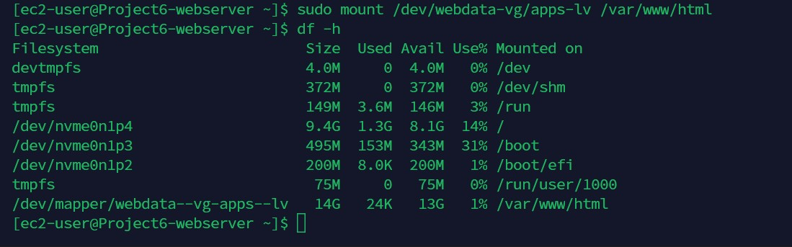

18. Use `rsync` utility to backup all the files in the log directory /var/log into /home/recovery/logs (This is required before mounting the file system)

`sudo rsync -av /var/log/. /home/recovery/logs/`

19. Mount /var/log on logs-lv logical volume. (Note that all the existing data on /var/log will be deleted. That is why step 18 above is very important)

`sudo mount /dev/webdata-vg/logs-lv /var/log`

`sudo ls -l /var/log`

20. Restore log files back into /var/log directory

`sudo rsync -av /home/recovery/logs/ /var/log`

*temporary mount update*

21. Update /etc/fstab file so that the mount configuration will persist after restart of the server.

*The UUID of the device will be used to update the /etc/fstab file*

`sudo blkid`

`sudo vi /etc/fstab`

*Update /etc/fstab in this format using your own UUID and rememeber to remove the leading and ending quotes*

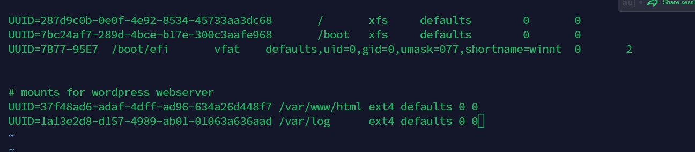

22. Test the configuration and reload the daemon

`sudo mount -a`

`sudo systemctl daemon-reload`

23. Verify your setup by running `df -h`, output must look like this:

### Step 2 - Prepare the Database Server

1.  Launch an EC2 instance that will serve as “Database Server”. Create 3 volumes in the same AZ as your Project6-DBserver EC2, each of 10 GB

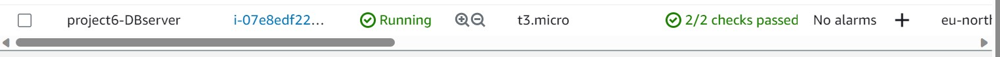

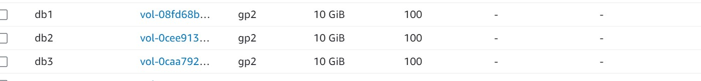

2. Attach all three volumes one by one to Project6-DBserver EC2 instance

3. Use `lsblk` command to inspect what block devices are attached to the server.

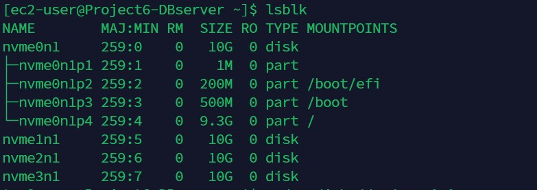

4.  Use `df -h` command to see all mounts and free space on your server

5. Use gdisk utility to create a single partition on each of the 3 disks

`sudo gdisk /dev/nvme1n1`

5. Use `lsblk` utility to view the newly configured partition on each of the 3 disks.

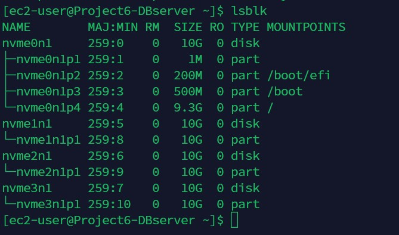

6. Install lvm2 package using `sudo yum install lvm2` . Run `sudo lvmdiskscan` command to check for available partitions.

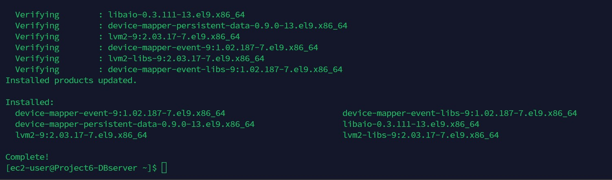

`sudo lvmdiskscan`

7. Use `pvcreate` utility to mark each of 3 disks as physical volumes (PVs) to be used by LVM

`sudo pvcreate /dev/nvme1n1p1 /dev/nvme2n1p1 /dev/nvme3n1p1`

8. Verify that your Physical volume has been created successfully by running  

`sudo pvs`

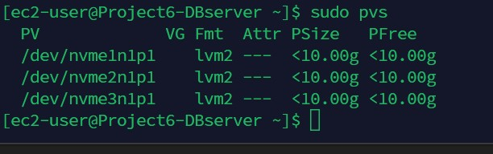

9. Use `vgcreate` utility to add all 3 PVs to a volume group (VG). Name the VG database-vg

`sudo vgcreate database-vg /dev/nvme1n1p1 /dev/nvme2n1p1 /dev/nvme3n1p1`

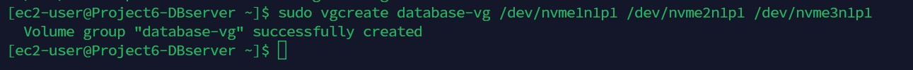

10. Verify that your VG has been created successfully by running sudo vgs

`sudo vgs`

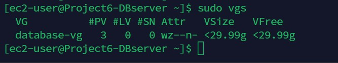

11. Use `lvcreate` utility to create a db-lv logical volume. 

`sudo lvcreate -n db-lv -L 20G database-vg`

12. Verify that your Logical Volume has been created successfully by running

`sudo lvs`

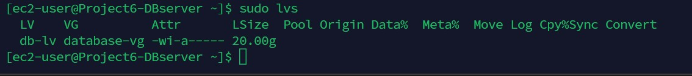

13. Verify the entire setup

`sudo vgdisplay -v #view complete setup - VG, PV, and LV`

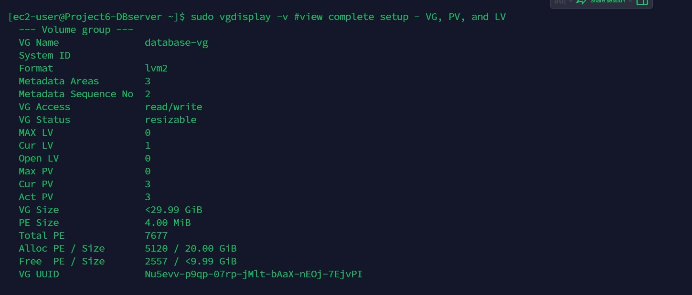

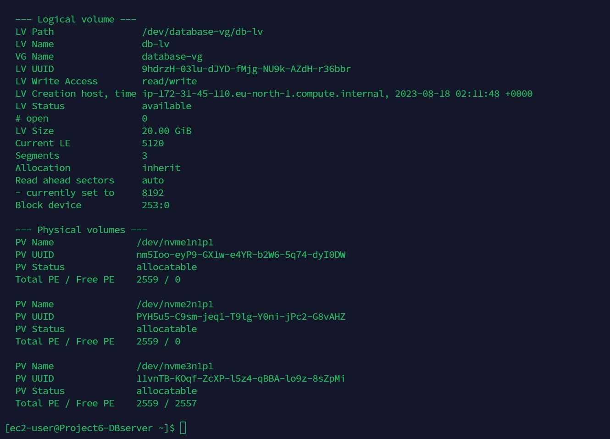

`sudo lsblk`

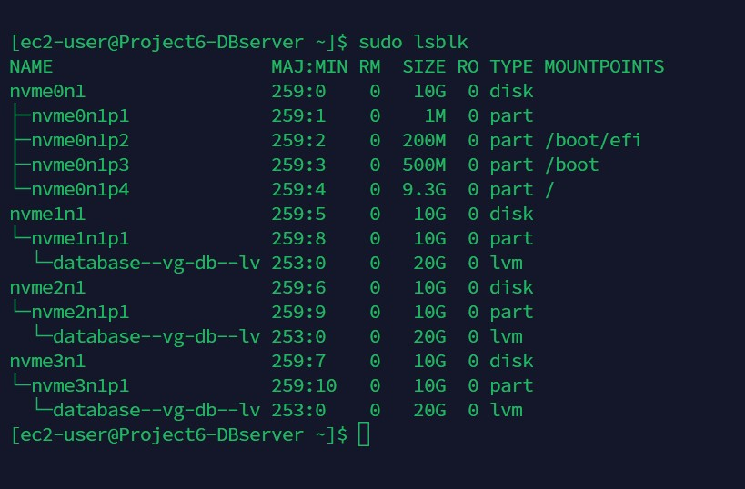

14. Use mkfs.ext4 to format the logical volume with ext4 filesystem

`sudo mkfs.ext4 /dev/database-vg/db-lv`

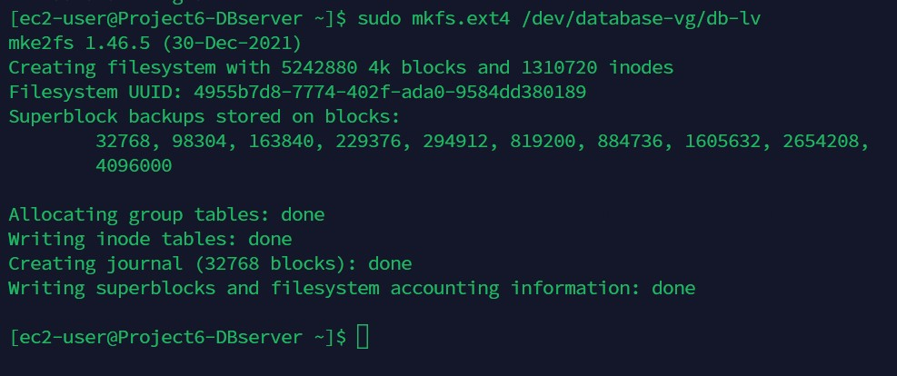

15. Create /db directory 

`sudo mkdir /db`

16. Mount /db on db-lv logical volume

`sudo mount /dev/database-vg/db-lv /db`

17. Check status using the code

`df -h`

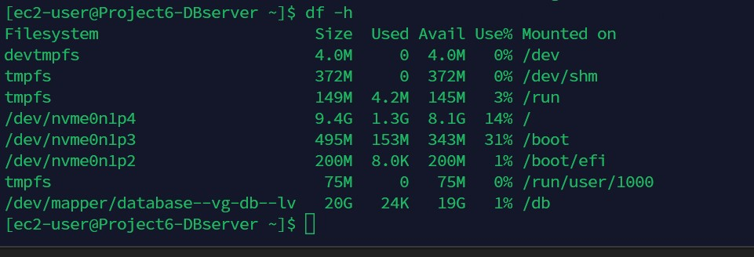

18. Update /etc/fstab file so that the mount configuration will persist after restart of the server.

*The UUID of the device will be used to update the /etc/fstab file*

`sudo blkid`

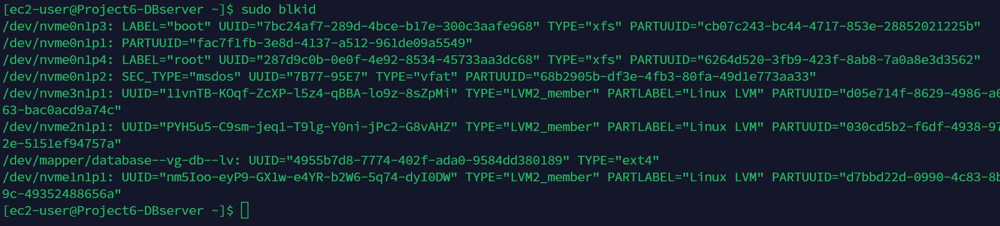

`sudo vi /etc/fstab`

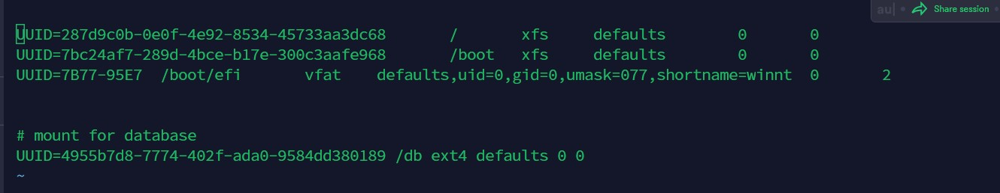

19. Test the configuration and reload the daemon

`sudo mount -a`

`sudo systemctl daemon-reload`

20. Verify your setup by running `df -h`, output must look like this:

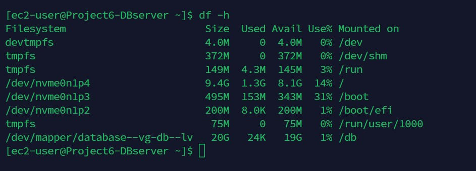

### Step 3 — Install WordPress on Web Server EC2

1. Update the repository

`sudo yum update -y`

2. Install wget, Apache and it’s dependencies

`sudo yum -y install wget httpd php php-mysqlnd php-fpm php-json`

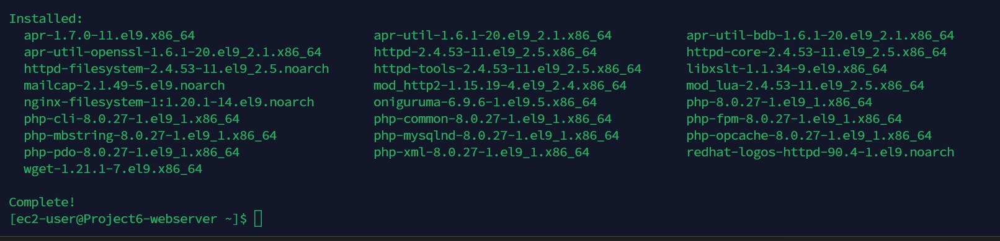

3. Start Apache

`sudo systemctl enable httpd`

`sudo systemctl start httpd`

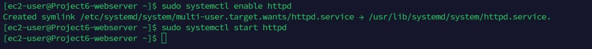

4. To install PHP and it’s depemdencies

`sudo yum install https://dl.fedoraproject.org/pub/epel/epel-release-latest-8.noarch.rpm`

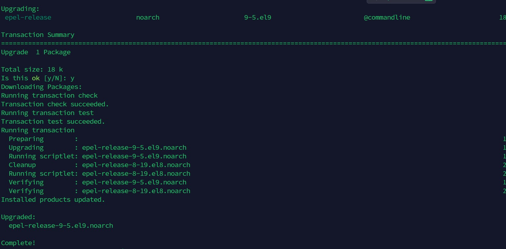

`sudo yum install yum-utils http://rpms.remirepo.net/enterprise/remi-release-8.rpm`

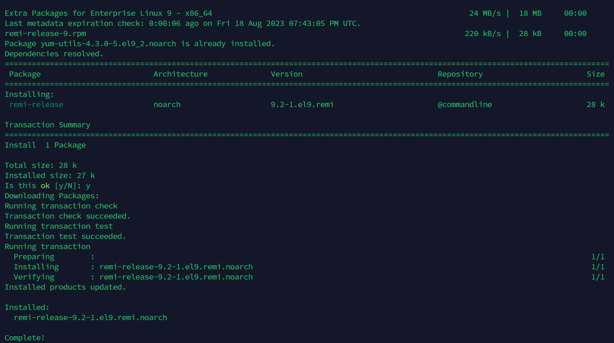

`sudo yum module list php`

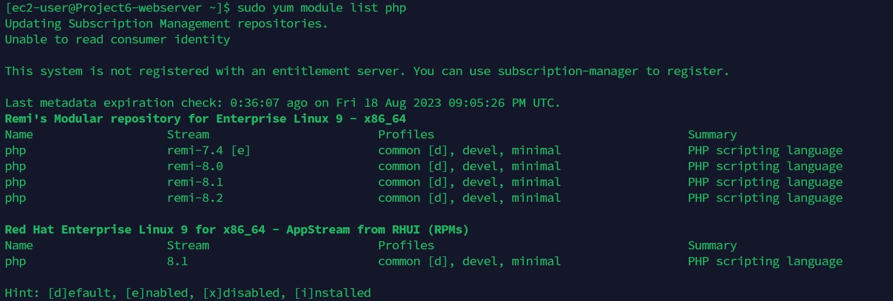

`sudo yum module reset php`

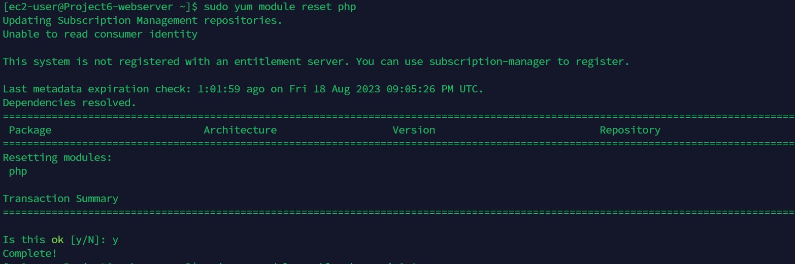

`sudo yum module enable php:remi-8.1`

`sudo yum install php php-opcache php-gd php-curl php-mysqlnd`

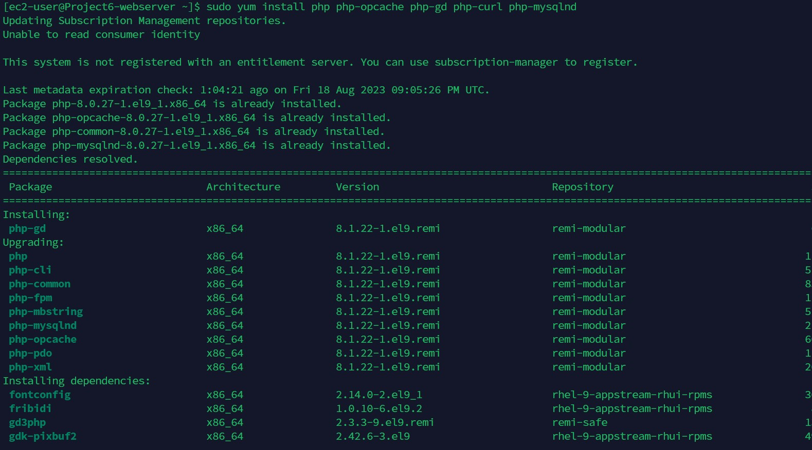

`sudo systemctl start php-fpm`

`sudo systemctl enable php-fpm`

`sudo setsebool -P httpd_execmem 1`

`sudo systemctl status php-fpm`

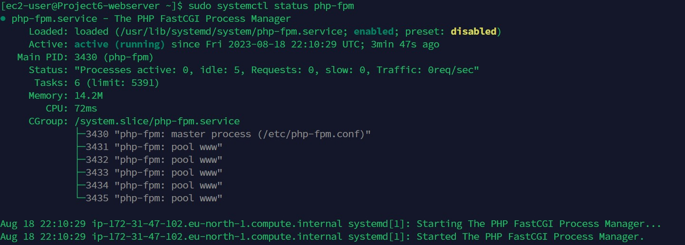

5. Restart Apache

`sudo systemctl restart httpd`

